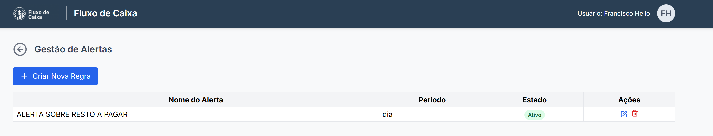

# Fluxo de Caixa 

Sistema web de fluxo de caixa voltado para prefeituras, estados  e órgãos públicos, com código aberto e reutilizável por outros municípios e estados.


## 📸 Demonstração Visual

Veja abaixo algumas das principais telas do sistema em funcionamento.

**Tela de Login e Dashboard Principal**


**Relatórios**


**Saldos/Lançamentos**


**Cenários**


**Mapeamento**


**Alertas**




## 🌐 Página do Projeto e Comunicação

Acompanhe novidades e o código mais recente em [https://github.com/heliojunior1/FluxoDeCaixa](https://github.com/heliojunior1/FluxoDeCaixa). Se o serviço estiver em execução no Render, acesse [https://fluxodecaixa-1kxt.onrender.com/](https://fluxodecaixa-1kxt.onrender.com/).

Para dúvidas ou sugestões, abra uma [issue](https://github.com/heliojunior1/FluxoDeCaixa/issues).

## 🚀 Como Executar o Projeto

### Pré-requisitos
- Python 3.8 ou superior
- pip (gerenciador de pacotes do Python)

### 1. Clone o Repositório
```bash
git clone <url-do-repositorio>
cd FluxoDeCaixa
```

### 2. Criação do Ambiente Virtual

**Importante**: Sempre use um ambiente virtual para isolar as dependências do projeto.

#### No Windows (PowerShell ou CMD):
```powershell
# Criar ambiente virtual
python -m venv venv

# Ativar ambiente virtual (PowerShell)
.\venv\Scripts\Activate.ps1

# OU ativar ambiente virtual (CMD)
venv\Scripts\activate.bat
```

#### No Linux/Mac:
```bash
# Criar ambiente virtual
python3 -m venv venv

# Ativar ambiente virtual
source venv/bin/activate
```

### 3. Instalação das Dependências

Com o ambiente virtual ativado, instale as dependências:

```bash
pip install -r requirements.txt
```

### 4. Executar a Aplicação

#### Opção 1: Usando Python diretamente (RECOMENDADO)
```bash
python app.py
```

#### Opção 2: Usando Uvicorn com PYTHONPATH
```bash
# Windows PowerShell
$env:PYTHONPATH = "src"
uvicorn fluxocaixa.main:app --reload --host 0.0.0.0 --port 8000

# Linux/Mac
export PYTHONPATH=src
uvicorn fluxocaixa.main:app --reload --host 0.0.0.0 --port 8000

# Windows CMD
set PYTHONPATH=src
uvicorn fluxocaixa.main:app --reload --host 0.0.0.0 --port 8000
```

#### Opção 3: Executar a partir da pasta src
```bash
cd src
uvicorn fluxocaixa.main:app --reload --host 0.0.0.0 --port 8000
```

**Nota sobre Gunicorn no Windows:** O Gunicorn não funciona nativamente no Windows devido à dependência do módulo `fcntl`. Para desenvolvimento local no Windows, use as opções 1 ou 2. O Gunicorn é usado apenas em produção (Linux) no Render.com.

### 5. Acessar a Aplicação

Após iniciar o servidor, acesse:
- **Aplicação**: http://localhost:8000
- **Documentação da API**: http://localhost:8000/docs
- **Inicializar BD**: http://localhost:8000/init-db

## 📋 Inicialização do Banco de Dados

O projeto usa SQLite como banco de dados padrão. Na primeira execução:

1. **Inicialização automática**: O banco é criado automaticamente na pasta `instance/`
2. **Dados de exemplo**: Acesse http://localhost:8000/init-db para popular o banco com dados de exemplo
3. **Recriar banco**: Para começar do zero, acesse http://localhost:8000/recreate-db

## ⚙️ Funcionalidades

- **Saldos**: Visualização e gerenciamento de lançamentos financeiros
- **Filtros**: Por data, tipo, descrição e qualificador
- **Inserção Manual**: Adição de novos lançamentos
- **Importação**: Cadastro em massa via upload de CSV ou XLSX
- **Modelo de Planilha**: Download de template XLSX em `/saldos/template-xlsx`
- **Edição/Exclusão**: Modificação de lançamentos existentes
- **Conferência**: Visualização de registros de conferência
- **Projeções**: Gestão de cenários e projeções financeiras
- **Relatórios**: Diversos relatórios financeiros e análises
- **Mapeamentos**: Configuração de mapeamentos de qualificadores
- **Alerta**: Criação de alertas para os qualificadores, saldo e projecao vs realizado

## 📁 Estrutura do Projeto

```
FluxoCaixaCodex/
├── src/
│   └── fluxocaixa/
│       ├── models/          # Modelos de dados (SQLAlchemy)
│       ├── web/             # Rotas da API (FastAPI)
│       ├── services/        # Serviços e lógica de negócio
│       ├── utils/           # Utilitários e formatadores
│       └── static/          # Arquivos estáticos
├── templates/               # Templates HTML (Jinja2)
├── instance/               # Banco de dados SQLite
├── requirements.txt        # Dependências Python
├── app.py                 # Ponto de entrada da aplicação
└── README.md              # Este arquivo
```

## 🗄️ Modelo de Banco de Dados

O sistema utiliza **SQLite** como banco de dados padrão e **SQLAlchemy** como ORM. A estrutura é composta por 12 tabelas principais que gerenciam todo o fluxo de caixa.

### 📊 Diagrama de Relacionamentos

```
┌─────────────────────┐
│  flc_qualificador   │◄─────────┐
│  (Hierárquico)      │          │
├─────────────────────┤          │
│ seq_qualificador PK │          │
│ num_qualificador    │          │
│ dsc_qualificador    │          │
│ cod_qualificador_pai│──────────┘ (Auto-relacionamento)
│ dat_inclusao        │
│ ind_status          │
└─────────────────────┘
         △  △  △
         │  │  │
         │  │  └────────────────────┐
         │  │                       │
         │  └──────────────┐        │
         │                 │        │
┌────────┴──────────┐ ┌────┴────────┴─────┐
│  flc_lancamento   │ │  flc_mapeamento   │
├───────────────────┤ ├───────────────────┤
│ seq_lancamento PK │ │ seq_mapeamento PK │
│ dat_lancamento    │ │ seq_qualificador  │FK
│ seq_qualificador  │FK│ dsc_mapeamento   │
│ val_lancamento    │ │ txt_condicao      │
│ cod_tipo_lanc.    │FK│ ind_status       │
│ cod_origem_lanc.  │FK│ dat_inclusao     │
│ seq_conta         │FK└───────────────────┘
│ ind_origem        │           △
│ dat_inclusao      │           │
│ cod_pessoa_incl.  │  ┌────────┴────────┐
│ dat_alteracao     │  │   flc_alerta    │
│ cod_pessoa_alter. │  ├─────────────────┤
│ ind_status        │  │ seq_alerta   PK │
└───────────────────┘  │ nom_alerta      │
    │    │             │ metric          │
    │    │             │ seq_qualificador│FK
    │    │             │ logic           │
    │    │             │ valor           │
    │    └──────┐      │ period          │
    │           │      │ emails          │
    │           │      │ notif_system    │
    ▼           ▼      │ notif_email     │
┌─────────┐ ┌─────────┐│ ind_status      │
│flc_tipo_│ │flc_origem│ dat_inclusao    │
│lancament│ │lancament││ cod_pessoa_incl.│
├─────────┤ ├─────────┤│ dat_alteracao   │
│cod PK   │ │cod PK   ││ cod_pessoa_alter│
│dsc_tipo │ │dsc_orig.││ └─────────────────┘
└─────────┘ └─────────┘
                       ┌──────────────────┐
    ┌──────────────────┤ flc_conta_banc.  │
    │                  ├──────────────────┤
    │                  │ seq_conta     PK │
    │                  │ cod_banco        │
    │                  │ num_agencia      │
    │                  │ num_conta        │
    │                  │ dsc_conta        │
    │                  │ ind_status       │
    │                  │ dat_cadastro     │
    │                  └──────────────────┘
    │
    │  ┌──────────────────────┐
    └──│  flc_pagamento       │
       ├──────────────────────┤
       │ seq_pagamento     PK │
       │ dat_pagamento        │
       │ cod_orgao           │FK───┐
       │ val_pagamento        │    │
       │ dsc_pagamento        │    │
       │ dat_inclusao         │    │
       └──────────────────────┘    │
                                   ▼
                          ┌────────────────┐
                          │  flc_orgao     │
                          ├────────────────┤
                          │ cod_orgao   PK │
                          │ nom_orgao      │
                          └────────────────┘

┌───────────────────────┐
│  flc_conferencia      │
├───────────────────────┤
│ dat_conferencia    PK │
│ val_saldo_anterior    │
│ val_liberacoes        │
│ val_conf_liberacoes   │
│ val_soma_anter_liber. │
│ val_pagamentos        │
│ val_conf_pagamentos   │
│ val_saldo_final       │
└───────────────────────┘

┌────────────────────────────┐
│  flc_cenario               │
├────────────────────────────┤
│ seq_cenario             PK │
│ nom_cenario                │
│ dsc_cenario                │
│ dat_criacao                │
│ ind_status                 │
│ dat_inclusao               │
│ cod_pessoa_inclusao        │
│ dat_alteracao              │
│ cod_pessoa_alteracao       │
└────────────────────────────┘
         △
         │
         │
┌────────┴───────────────────────────┐
│ flc_cenario_ajuste_mensal          │
├────────────────────────────────────┤
│ seq_cenario_ajuste              PK │
│ seq_cenario                     FK │
│ seq_qualificador                FK │
│ ano                                │
│ mes                                │
│ cod_tipo_ajuste (P=%, V=valor)     │
│ val_ajuste                         │
│ dsc_ajuste                         │
│ dat_inclusao                       │
└────────────────────────────────────┘
UNIQUE: (seq_cenario, seq_qualificador, ano, mes)
```

### 📋 Descrição das Tabelas

#### 1. **flc_qualificador** - Classificação Hierárquica dos Lançamentos
Estrutura hierárquica em árvore para classificação de receitas e despesas.

| Campo | Tipo | Descrição |
|-------|------|-----------|
| seq_qualificador | INTEGER (PK) | Identificador único |
| num_qualificador | VARCHAR(20) | Código/número do qualificador (único) |
| dsc_qualificador | VARCHAR(255) | Descrição/nome do qualificador |
| cod_qualificador_pai | INTEGER (FK) | Referência ao qualificador pai (auto-relacionamento) |
| dat_inclusao | DATE | Data de cadastro |
| ind_status | CHAR(1) | Status (A=Ativo, I=Inativo) |

**Características:**
- Suporta múltiplos níveis hierárquicos
- Qualificadores iniciados com "1" = Receitas
- Qualificadores iniciados com "2" = Despesas
- Possui métodos para navegação na árvore (pai, filhos, raiz)

#### 2. **flc_lancamento** - Lançamentos Financeiros
Registro de todas as movimentações financeiras (receitas e despesas).

| Campo | Tipo | Descrição |
|-------|------|-----------|
| seq_lancamento | INTEGER (PK) | Identificador único |
| dat_lancamento | DATE | Data do lançamento |
| seq_qualificador | INTEGER (FK) | Classificação do lançamento |
| val_lancamento | NUMERIC(18,2) | Valor (positivo=receita, negativo=despesa) |
| cod_tipo_lancamento | INTEGER (FK) | Tipo do lançamento |
| cod_origem_lancamento | INTEGER (FK) | Origem do lançamento |
| seq_conta | INTEGER (FK) | Conta bancária (opcional) |
| ind_origem | CHAR(1) | Indicador de origem |
| dat_inclusao | DATE | Data de cadastro |
| cod_pessoa_inclusao | INTEGER | Usuário que incluiu |
| dat_alteracao | DATE | Data da última alteração |
| cod_pessoa_alteracao | INTEGER | Usuário que alterou |
| ind_status | CHAR(1) | Status (A=Ativo, I=Inativo) |

#### 3. **flc_tipo_lancamento** - Tipos de Lançamento
Tabela auxiliar com os tipos de lançamento (ex: Realizado, Previsto).

| Campo | Tipo | Descrição |
|-------|------|-----------|
| cod_tipo_lancamento | INTEGER (PK) | Código do tipo |
| dsc_tipo_lancamento | VARCHAR(50) | Descrição do tipo |

#### 4. **flc_origem_lancamento** - Origens de Lançamento
Tabela auxiliar com as origens dos lançamentos (ex: Manual, Importação).

| Campo | Tipo | Descrição |
|-------|------|-----------|
| cod_origem_lancamento | INTEGER (PK) | Código da origem |
| dsc_origem_lancamento | VARCHAR(50) | Descrição da origem |

#### 5. **flc_conta_bancaria** - Contas Bancárias
Cadastro de contas bancárias do órgão.

| Campo | Tipo | Descrição |
|-------|------|-----------|
| seq_conta | INTEGER (PK) | Identificador único |
| cod_banco | VARCHAR(10) | Código do banco |
| num_agencia | VARCHAR(20) | Número da agência |
| num_conta | VARCHAR(30) | Número da conta |
| dsc_conta | VARCHAR(100) | Descrição/apelido da conta |
| ind_status | CHAR(1) | Status (A=Ativo, I=Inativo) |
| dat_cadastro | DATE | Data de cadastro |

#### 6. **flc_mapeamento** - Mapeamento de Qualificadores
Regras para classificação automática de lançamentos.

| Campo | Tipo | Descrição |
|-------|------|-----------|
| seq_mapeamento | INTEGER (PK) | Identificador único |
| seq_qualificador | INTEGER (FK) | Qualificador associado |
| dsc_mapeamento | VARCHAR(255) | Descrição do mapeamento |
| txt_condicao | VARCHAR(500) | Condição/regra de mapeamento |
| ind_status | CHAR(1) | Status (A=Ativo, I=Inativo) |
| dat_inclusao | DATE | Data de cadastro |

#### 7. **flc_alerta** - Sistema de Alertas
Configuração de alertas para monitoramento de saldos e projeções.

| Campo | Tipo | Descrição |
|-------|------|-----------|
| seq_alerta | INTEGER (PK) | Identificador único |
| nom_alerta | VARCHAR(255) | Nome do alerta |
| metric | VARCHAR(20) | Métrica monitorada (saldo, projecao_vs_realizado) |
| seq_qualificador | INTEGER (FK) | Qualificador monitorado (opcional) |
| logic | VARCHAR(20) | Lógica de comparação (maior_que, menor_que, etc) |
| valor | NUMERIC(18,2) | Valor de referência |
| period | VARCHAR(20) | Período de análise |
| emails | VARCHAR(255) | E-mails para notificação |
| notif_system | CHAR(1) | Notificação no sistema (S/N) |
| notif_email | CHAR(1) | Notificação por e-mail (S/N) |
| ind_status | CHAR(1) | Status (A=Ativo, I=Inativo) |
| dat_inclusao | DATE | Data de cadastro |
| cod_pessoa_inclusao | INTEGER | Usuário que incluiu |
| dat_alteracao | DATE | Data da última alteração |
| cod_pessoa_alteracao | INTEGER | Usuário que alterou |

#### 8. **flc_pagamento** - Pagamentos
Registro de pagamentos realizados por órgãos.

| Campo | Tipo | Descrição |
|-------|------|-----------|
| seq_pagamento | INTEGER (PK) | Identificador único |
| dat_pagamento | DATE | Data do pagamento |
| cod_orgao | INTEGER (FK) | Órgão responsável pelo pagamento |
| val_pagamento | NUMERIC(18,2) | Valor do pagamento |
| dsc_pagamento | VARCHAR(255) | Descrição do pagamento |
| dat_inclusao | DATE | Data de cadastro |

#### 9. **flc_orgao** - Órgãos
Cadastro de órgãos públicos.

| Campo | Tipo | Descrição |
|-------|------|-----------|
| cod_orgao | INTEGER (PK) | Código do órgão |
| nom_orgao | VARCHAR(100) | Nome do órgão |

#### 10. **flc_conferencia** - Conferência de Saldos
Registro de conferências diárias de saldos.

| Campo | Tipo | Descrição |
|-------|------|-----------|
| dat_conferencia | DATE (PK) | Data da conferência |
| val_saldo_anterior | NUMERIC(18,2) | Saldo do dia anterior |
| val_liberacoes | NUMERIC(18,2) | Valor das liberações |
| val_conf_liberacoes | NUMERIC(18,2) | Conferência das liberações |
| val_soma_anter_liberacoes | NUMERIC(18,2) | Soma anterior + liberações |
| val_pagamentos | NUMERIC(18,2) | Valor dos pagamentos |
| val_conf_pagamentos | NUMERIC(18,2) | Conferência dos pagamentos |
| val_saldo_final | NUMERIC(18,2) | Saldo final do dia |

#### 11. **flc_cenario** - Cenários de Projeção
Cenários para projeções financeiras futuras.

| Campo | Tipo | Descrição |
|-------|------|-----------|
| seq_cenario | INTEGER (PK) | Identificador único |
| nom_cenario | VARCHAR(100) | Nome do cenário |
| dsc_cenario | VARCHAR(255) | Descrição do cenário |
| dat_criacao | DATE | Data de criação |
| ind_status | CHAR(1) | Status (A=Ativo, I=Inativo) |
| dat_inclusao | DATE | Data de cadastro |
| cod_pessoa_inclusao | INTEGER | Usuário que incluiu |
| dat_alteracao | DATE | Data da última alteração |
| cod_pessoa_alteracao | INTEGER | Usuário que alterou |

#### 12. **flc_cenario_ajuste_mensal** - Ajustes Mensais de Cenário
Ajustes mensais aplicados aos cenários de projeção.

| Campo | Tipo | Descrição |
|-------|------|-----------|
| seq_cenario_ajuste | INTEGER (PK) | Identificador único |
| seq_cenario | INTEGER (FK) | Cenário associado |
| seq_qualificador | INTEGER (FK) | Qualificador afetado |
| ano | INTEGER | Ano do ajuste |
| mes | INTEGER | Mês do ajuste (1-12) |
| cod_tipo_ajuste | CHAR(1) | Tipo: P=Percentual, V=Valor fixo |
| val_ajuste | NUMERIC(18,2) | Valor ou percentual do ajuste |
| dsc_ajuste | VARCHAR(100) | Descrição do ajuste |
| dat_inclusao | DATE | Data de cadastro |

**Constraint:** UNIQUE (seq_cenario, seq_qualificador, ano, mes)

### 🔗 Relacionamentos Principais

1. **flc_qualificador** (auto-relacionamento)
   - Um qualificador pai pode ter vários qualificadores filhos
   - Estrutura hierárquica em árvore

2. **flc_lancamento** → **flc_qualificador**
   - Cada lançamento pertence a um qualificador
   - Relacionamento N:1

3. **flc_lancamento** → **flc_tipo_lancamento**
   - Cada lançamento tem um tipo
   - Relacionamento N:1

4. **flc_lancamento** → **flc_origem_lancamento**
   - Cada lançamento tem uma origem
   - Relacionamento N:1

5. **flc_lancamento** → **flc_conta_bancaria**
   - Lançamento pode estar vinculado a uma conta (opcional)
   - Relacionamento N:1

6. **flc_mapeamento** → **flc_qualificador**
   - Cada mapeamento está associado a um qualificador
   - Relacionamento N:1

7. **flc_alerta** → **flc_qualificador**
   - Alerta pode monitorar um qualificador específico (opcional)
   - Relacionamento N:1

8. **flc_pagamento** → **flc_orgao**
   - Cada pagamento pertence a um órgão
   - Relacionamento N:1

9. **flc_cenario_ajuste_mensal** → **flc_cenario**
   - Ajustes pertencem a um cenário
   - Relacionamento N:1 com cascade delete

10. **flc_cenario_ajuste_mensal** → **flc_qualificador**
    - Ajustes aplicados a qualificadores específicos
    - Relacionamento N:1

### 📝 Observações Importantes

- **Banco de Dados:** SQLite (padrão) - facilmente migrável para PostgreSQL/MySQL
- **ORM:** SQLAlchemy 2.0+
- **Convenção de Nomenclatura:** Prefixo "flc_" em todas as tabelas
- **Campos de Auditoria:** Presente em tabelas principais (dat_inclusao, cod_pessoa_inclusao, dat_alteracao, cod_pessoa_alteracao)
- **Soft Delete:** Utiliza ind_status (A/I) em vez de exclusão física
- **Precision Decimal:** NUMERIC(18,2) para todos os valores monetários

## 🔧 Comandos Úteis

```bash
# Ativar ambiente virtual
.\venv\Scripts\Activate.ps1  # Windows PowerShell
venv\Scripts\activate.bat    # Windows CMD
source venv/bin/activate     # Linux/Mac

# Instalar dependências
pip install -r requirements.txt

# Executar aplicação
python app.py

# Executar com reload automático
uvicorn src.fluxocaixa.main:app --reload

# Executar testes
python -m pytest src/tests/

# Desativar ambiente virtual
deactivate
```

## 🛠️ Resolução de Problemas

### Erro "Python não foi encontrado" no Windows

Se você receber este erro ao tentar usar `python3`:

#### Solução 1: Use `python` em vez de `python3`
```powershell
# Windows usa 'python' por padrão
python -m venv venv
python app.py
```

#### Solução 2: Instalar Python pelo Microsoft Store
1. Digite `python` no prompt
2. Será aberto o Microsoft Store
3. Instale a versão mais recente do Python

#### Solução 3: Verificar se Python está no PATH
```powershell
# Verificar se Python está instalado
python --version
# ou
py --version
```

### Erro "ModuleNotFoundError: No module named 'fluxocaixa'"

Este é o erro mais comum. Soluções:

#### Solução 1: Use o app.py (RECOMENDADO)
```bash
python app.py
```
O arquivo `app.py` já está configurado para encontrar o módulo automaticamente.

#### Solução 2: Configure o PYTHONPATH
```bash
# Windows PowerShell
$env:PYTHONPATH = "src"

# Linux/Mac
export PYTHONPATH=src

# Windows CMD
set PYTHONPATH=src
```

#### Solução 3: Execute a partir da pasta src
```bash
cd src
uvicorn fluxocaixa.main:app --reload
```

### Erro de Ativação do Ambiente Virtual no Windows

Se você receber erro ao tentar ativar o ambiente virtual no PowerShell:

1. **Alterar política de execução** (execute como administrador):
```powershell
Set-ExecutionPolicy -ExecutionPolicy RemoteSigned -Scope CurrentUser
```

2. **Usar comando completo**:
```powershell
& ".\venv\Scripts\Activate.ps1"
```

3. **Alternativa usando CMD**:
```cmd
venv\Scripts\activate.bat
```

### Erro "ModuleNotFoundError: No module named 'fcntl'" (Gunicorn no Windows)

O Gunicorn não funciona nativamente no Windows porque usa o módulo `fcntl` que não está disponível.

**Soluções para desenvolvimento local:**
- Use `python app.py` (recomendado)
- Use `uvicorn` diretamente

**Para produção:** O Gunicorn funciona perfeitamente no Render.com (Linux)

### Erro de Importação de Módulos

Se encontrar erros de importação, certifique-se de:

1. **Ambiente virtual ativado**:
```bash
# Verificar se o venv está ativo (deve aparecer (venv) no prompt)
which python  # Linux/Mac
where python   # Windows
```

2. **PYTHONPATH configurado** (se necessário):
```bash
export PYTHONPATH=src                # Linux/Mac
$env:PYTHONPATH = "src"             # PowerShell
set PYTHONPATH=src                  # CMD Windows
```

### Erro de Banco de Dados

Se houver problemas com o banco de dados (por exemplo, erro "no such column"):

1. **Recriar automaticamente**:
   Acesse [http://localhost:8000/recreate-db](http://localhost:8000/recreate-db).
   Isso apagará o arquivo `instance/fluxo.db` e criará todas as tabelas novamente.

2. **Opção manual**:
```bash
rm instance/fluxo.db  # Linux/Mac
del instance\fluxo.db # Windows
```
Depois, acesse [http://localhost:8000/init-db](http://localhost:8000/init-db) para gerar o banco e inserir dados de exemplo.

### Porta já em Uso

Se a porta 8000 estiver ocupada:

```bash
# Usar porta diferente
uvicorn src.fluxocaixa.main:app --port 8080

# Ou encontrar processo usando a porta
netstat -ano | findstr :8000  # Windows
lsof -i :8000                 # Linux/Mac
```

## 📊 Dados de Exemplo

O sistema inclui dados realísticos para 2024 e 2025:
- **Receitas**: ICMS, IPVA, IR, FPE, FECOEP, etc.
- **Despesas**: Folha, Repasses, Saúde, Educação, etc.
- **Estrutura hierárquica** de qualificadores
- **Mapeamentos** e **cenários** de exemplo

## 🚀 Deploy

Para deploy em produção, configure:

1. **Variáveis de ambiente** no arquivo `.env`
2. **Banco de dados** apropriado (PostgreSQL recomendado)
3. **Servidor web** como Nginx + Gunicorn

---
> **Licença:** este projeto está sob a [MIT License](LICENSE).

## English Summary
This FastAPI application helps manage public revenues and expenses. The full documentation is available in [Portuguese](#fluxo-de-caixa).
