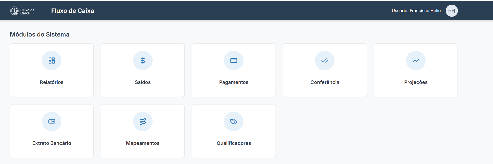
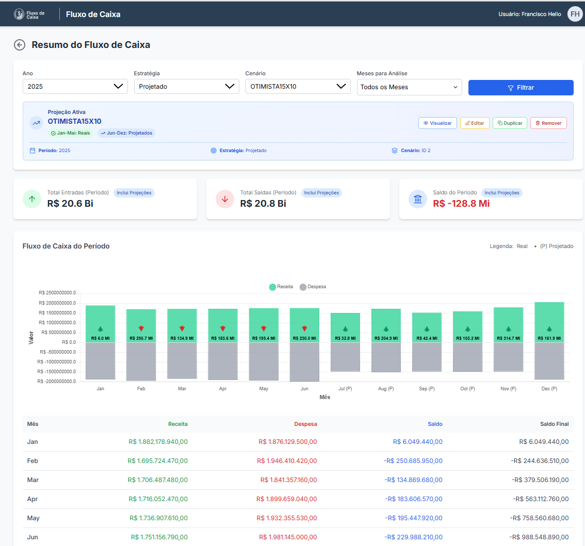
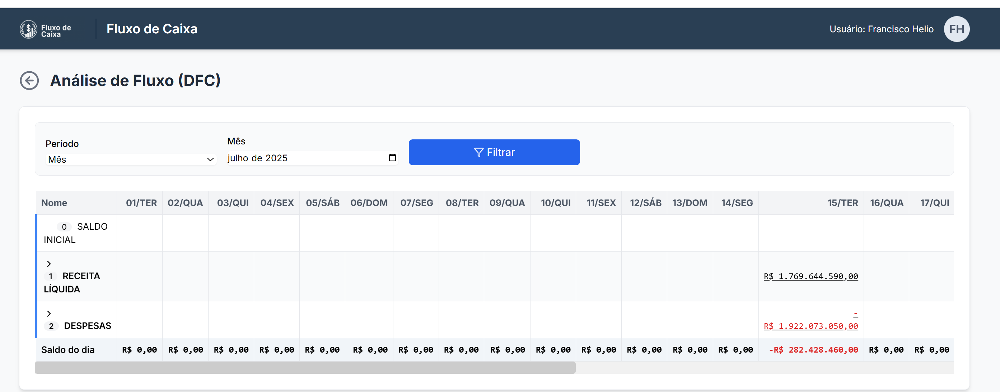
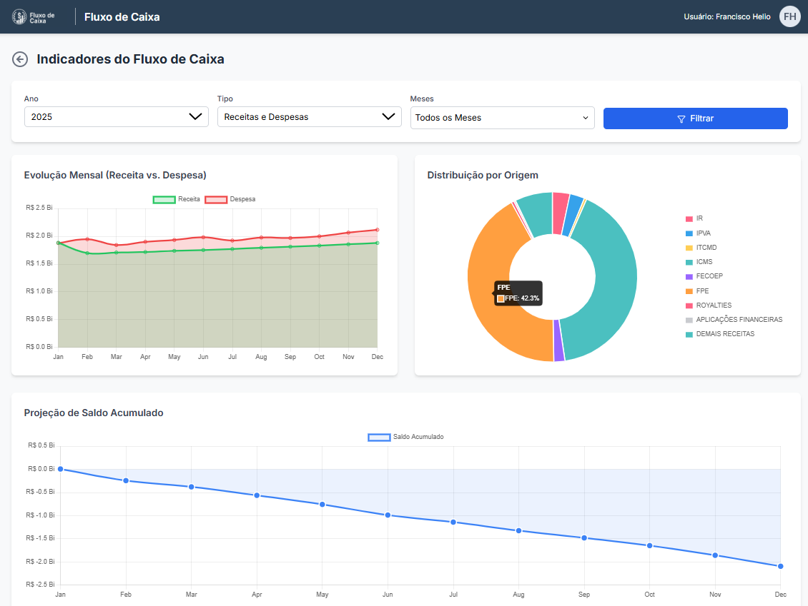
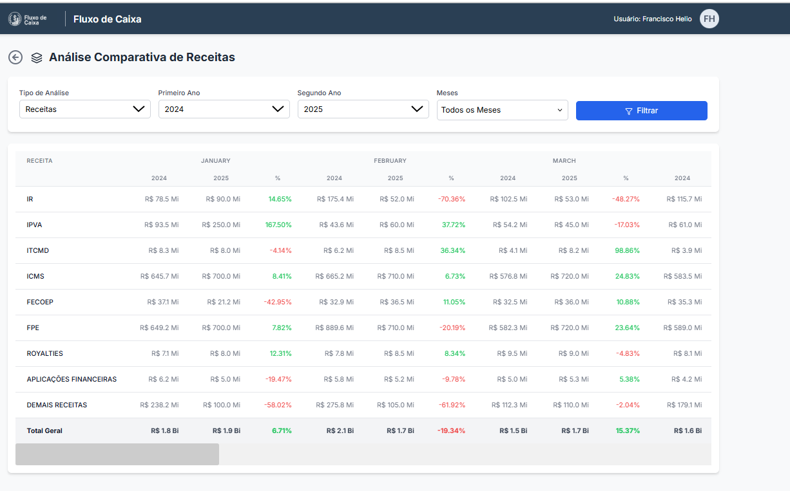
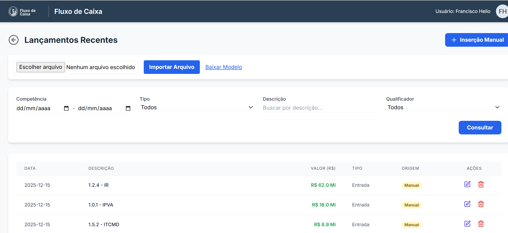
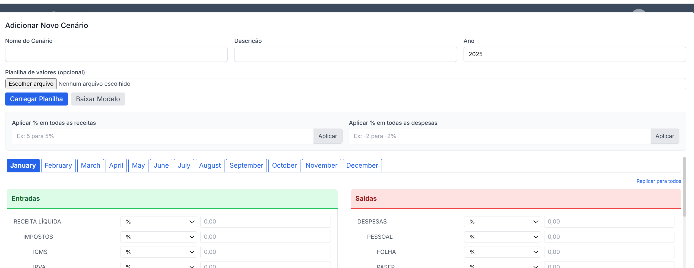
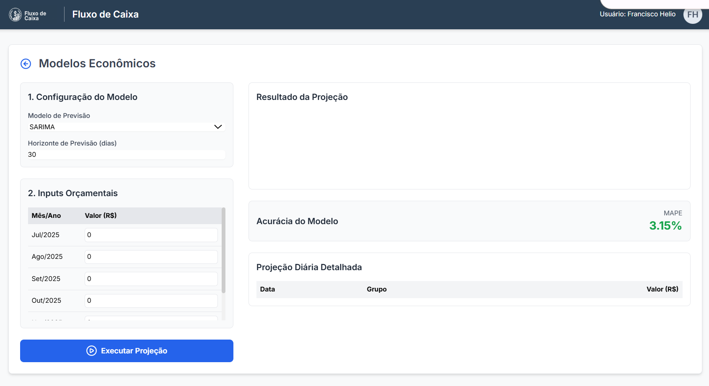
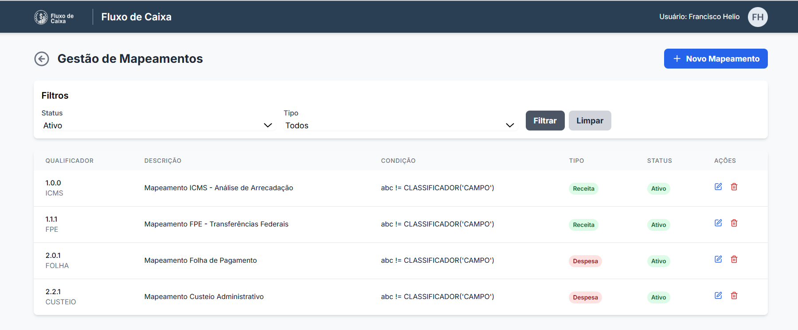
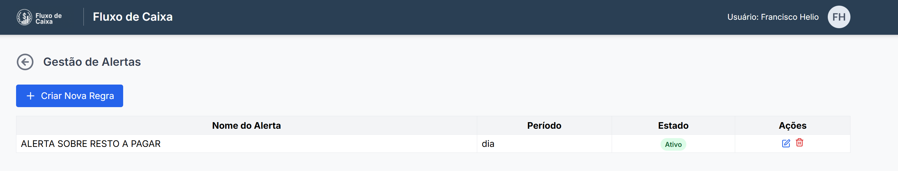

# Fluxo de Caixa 

Sistema web de fluxo de caixa voltado para prefeituras, estados  e órgãos públicos, com código aberto e reutilizável por outros municípios e estados.


## 📸 Demonstração Visual

Veja abaixo algumas das principais telas do sistema em funcionamento.

**Tela de Login e Dashboard Principal**



**Relatórios**









**Saldos/Lançamentos**



**Cenários**





**Mapeamento**



**Alertas**




## 🌐 Página do Projeto e Comunicação

Acompanhe novidades e o código mais recente em [https://github.com/heliojunior1/FluxoDeCaixa](https://github.com/heliojunior1/FluxoDeCaixa). Se o serviço estiver em execução no Render, acesse [https://fluxodecaixa-1kxt.onrender.com/](https://fluxodecaixa-1kxt.onrender.com/).

Para dúvidas ou sugestões, abra uma [issue](https://github.com/heliojunior1/FluxoDeCaixa/issues).

## 🚀 Como Executar o Projeto

### Pré-requisitos
- Python 3.8 ou superior
- pip (gerenciador de pacotes do Python)

### 1. Clone o Repositório
```bash
git clone <url-do-repositorio>
cd FluxoDeCaixa
```

### 2. Criação do Ambiente Virtual

**Importante**: Sempre use um ambiente virtual para isolar as dependências do projeto.

#### No Windows (PowerShell ou CMD):
```powershell
# Criar ambiente virtual
python -m venv venv

# Ativar ambiente virtual (PowerShell)
.\venv\Scripts\Activate.ps1

# OU ativar ambiente virtual (CMD)
venv\Scripts\activate.bat
```

#### No Linux/Mac:
```bash
# Criar ambiente virtual
python3 -m venv venv

# Ativar ambiente virtual
source venv/bin/activate
```

### 3. Instalação das Dependências

Com o ambiente virtual ativado, instale as dependências:

```bash
 ```

### 4. Executar a Aplicação

#### Opção 1: Usando Python diretamente (RECOMENDADO)
```bash
python app.py
```

#### Opção 2: Usando Uvicorn com PYTHONPATH
```bash
# Windows PowerShell
$env:PYTHONPATH = "src"
uvicorn fluxocaixa.main:app --reload --host 0.0.0.0 --port 8000

# Linux/Mac
export PYTHONPATH=src
uvicorn fluxocaixa.main:app --reload --host 0.0.0.0 --port 8000

# Windows CMD
set PYTHONPATH=src
uvicorn fluxocaixa.main:app --reload --host 0.0.0.0 --port 8000
```

#### Opção 3: Executar a partir da pasta src
```bash
cd src
uvicorn fluxocaixa.main:app --reload --host 0.0.0.0 --port 8000
```

**Nota sobre Gunicorn no Windows:** O Gunicorn não funciona nativamente no Windows devido à dependência do módulo `fcntl`. Para desenvolvimento local no Windows, use as opções 1 ou 2. O Gunicorn é usado apenas em produção (Linux) no Render.com.

### 5. Acessar a Aplicação

Após iniciar o servidor, acesse:
- **Aplicação**: http://localhost:8000
- **Documentação da API**: http://localhost:8000/docs
- **Inicializar BD**: http://localhost:8000/init-db

## 📋 Inicialização do Banco de Dados

O projeto usa SQLite como banco de dados padrão. Na primeira execução:

1. **Inicialização automática**: O banco é criado automaticamente na pasta `instance/`
2. **Dados de exemplo**: Acesse http://localhost:8000/init-db para popular o banco com dados de exemplo
3. **Recriar banco**: Para começar do zero, acesse http://localhost:8000/recreate-db

## ⚙️ Funcionalidades

- **Saldos**: Visualização e gerenciamento de lançamentos financeiros
- **Filtros**: Por data, tipo, descrição e qualificador
- **Inserção Manual**: Adição de novos lançamentos
- **Importação**: Cadastro em massa via upload de CSV ou XLSX
- **Modelo de Planilha**: Download de template XLSX em `/saldos/template-xlsx`
- **Edição/Exclusão**: Modificação de lançamentos existentes
- **Conferência**: Visualização de registros de conferência
- **Projeções**: Gestão de cenários e projeções financeiras
- **Relatórios**: Diversos relatórios financeiros e análises
- **Mapeamentos**: Configuração de mapeamentos de qualificadores
- **Alerta**: Criação de alertas para os qualificadores, saldo e projecao vs realizado

## 📁 Estrutura do Projeto

```
FluxoCaixaCodex/
├── src/
│   └── fluxocaixa/
│       ├── models/          # Modelos de dados (SQLAlchemy)
│       ├── web/             # Rotas da API (FastAPI)
│       ├── services/        # Serviços e lógica de negócio
│       ├── utils/           # Utilitários e formatadores
│       └── static/          # Arquivos estáticos
├── templates/               # Templates HTML (Jinja2)
├── instance/               # Banco de dados SQLite
├── requirements.txt        # Dependências Python
├── app.py                 # Ponto de entrada da aplicação
└── README.md              # Este arquivo
```

## 🗄️ Modelo de Banco de Dados

O sistema utiliza **SQLite** como banco de dados padrão e **SQLAlchemy** como ORM. A estrutura foi expandida para suportar simulações complexas, histórico de saldos e alertas gerados.

### 📊 Diagrama de Relacionamentos Simplificado

```
┌─────────────────────┐
│  flc_qualificador   │◄─────────┐
│  (Hierárquico)      │          │
├─────────────────────┤          │
│ seq_qualificador PK │          │
│ cod_qualificador_pai│──────────┘
└─────────────────────┘
         △  △  △
         │  │  │
         │  │  └────────────────────┐
         │  │                       │
         │  └──────────────┐        │
         │                 │        │
┌────────┴──────────┐ ┌────┴────────┴─────┐
│  flc_lancamento   │ │  flc_mapeamento   │
├───────────────────┤ ├───────────────────┤
│ seq_lancamento PK │ │ seq_mapeamento PK │
│ seq_qualificadorFK│ │ seq_qualificadorFK│
└───────────────────┘ └───────────────────┘
                                    △
                                    │
                           ┌────────┴────────┐      ┌───────────────────┐
                           │   flc_alerta    │◄─────┤ flc_alerta_gerado │
                           ├─────────────────┤      ├───────────────────┤
                           │ seq_alerta   PK │      │ seq_gerado     PK │
                           │ seq_qualif.  FK │      │ seq_alerta     FK │
                           └─────────────────┘      └───────────────────┘

┌──────────────────┐       ┌─────────────────┐
│ flc_conta_banc.  │◄──────┤ flc_saldo_conta │
├──────────────────┤       ├─────────────────┤
│ seq_conta     PK │       │ seq_saldo    PK │
│ ...              │       │ seq_conta    FK │
└──────────────────┘       └─────────────────┘

      ┌───────────────────────┐
      │ flc_simulador_cenario │◄──────────────┐
      ├───────────────────────┤               │
      │ seq_simulador      PK │               │
      │ ...                   │               │
      └───────────────────────┘               │
          │             │                     │
          ▼             ▼                     │
┌─────────────────┐ ┌─────────────────┐ ┌─────┴───────────────┐
│flc_cenario_rec. │ │flc_cenario_desp.│ │flc_simulador_hist.  │
├─────────────────┤ ├─────────────────┤ ├─────────────────────┤
│seq_cenario_recPK│ │seq_cenario_desPK│ │seq_historico     PK │
│seq_simulador  FK│ │seq_simulador  FK│ │seq_simulador     FK │
└─────────────────┘ └─────────────────┘ └─────────────────────┘
        │                     │
        ▼                     ▼
┌─────────────────┐ ┌─────────────────┐
│flc_cen_rec_ajust│ │flc_cen_des_ajust│
├─────────────────┤ ├─────────────────┤
│seq_ajuste     PK│ │seq_ajuste     PK│
│seq_cenario_recFK│ │seq_cenario_desFK│
└─────────────────┘ └─────────────────┘
```

### 📋 Descrição das Tabelas

#### 1. **flc_qualificador** - Classificação Hierárquica
Estrutura em árvore para classificação de receitas e despesas.
- **PK**: `seq_qualificador`
- **Campos**: `num_qualificador`, `dsc_qualificador`, `cod_qualificador_pai` (FK)

#### 2. **flc_lancamento** - Lançamentos Financeiros
Registro de todas as movimentações financeiras.
- **PK**: `seq_lancamento`
- **FKs**: `seq_qualificador`, `cod_tipo_lancamento`, `cod_origem_lancamento`, `seq_conta`
- **Campos**: `dat_lancamento`, `val_lancamento`, `ind_origem`

#### 3. **flc_saldo_conta** - Saldos Diários [NOVO]
Armazena o saldo final de cada conta bancária por dia.
- **PK**: `seq_saldo_conta`
- **FK**: `seq_conta`
- **Campos**: `dat_saldo`, `val_saldo`
- **Constraint**: Único por conta e data.

#### 4. **flc_alerta** e **flc_alerta_gerado** - Sistema de Alertas [ATUALIZADO]
Configuração de regras de alerta e histórico de alertas disparados.
- **flc_alerta**: Regras (ex: "Saldo abaixo de X").
- **flc_alerta_gerado**: Ocorrências (ex: "Alerta disparado em 23/11/2025").

#### 5. **flc_simulador_cenario** - Motor de Simulação [NOVO]
Tabela principal para cenários de projeção avançada.
- **PK**: `seq_simulador_cenario`
- **Campos**: `nom_cenario`, `ano_base`, `meses_projecao`

#### 6. **flc_cenario_receita** e **flc_cenario_despesa** [NOVO]
Configurações específicas para projeção de receitas e despesas dentro de um cenário.
- **Campos**: `cod_tipo_cenario` (ex: 'MANUAL', 'REGRESSAO', 'MEDIA_HISTORICA'), `json_configuracao` (parâmetros do modelo).

#### 7. **flc_cenario_receita_ajuste** e **flc_cenario_despesa_ajuste** [NOVO]
Ajustes manuais (overrides) aplicados sobre as projeções calculadas.
- **Campos**: `ano`, `mes`, `val_ajuste`, `cod_tipo_ajuste` (Valor ou Percentual).

#### 8. **flc_modelo_economico_parametro** [NOVO]
Parâmetros para modelos econométricos (ex: coeficientes para PIB, Inflação).
- **FK**: `seq_cenario_receita`
- **Campos**: `nom_variavel`, `val_coeficiente`, `json_valores_historicos`.

#### 9. **flc_simulador_cenario_historico** [NOVO]
Snapshots (fotografias) de resultados de simulações passadas.
- **FK**: `seq_simulador_cenario`
- **Campos**: `dat_snapshot`, `json_snapshot` (resultado completo serializado).

#### Outras Tabelas Auxiliares
- **flc_tipo_lancamento**, **flc_origem_lancamento**: Domínios fixos.
- **flc_conta_bancaria**: Cadastro de contas.
- **flc_mapeamento**: Regras de classificação automática (De/Para).
- **flc_pagamento**, **flc_orgao**: Controle de pagamentos por órgão.
- **flc_conferencia**: Conferência diária de caixa.

### 📝 Observações
- **Soft Delete**: A maioria das tabelas usa `ind_status` ('A'/'I').
- **Auditoria**: Campos `dat_inclusao`, `cod_pessoa_inclusao`, etc.
- **Precisão**: Valores monetários usam `NUMERIC(18,2)`.

## 🔧 Comandos Úteis

```bash
# Ativar ambiente virtual
.\venv\Scripts\Activate.ps1  # Windows PowerShell
venv\Scripts\activate.bat    # Windows CMD
source venv/bin/activate     # Linux/Mac

# Instalar dependências
pip install -r requirements.txt

# Executar aplicação
python app.py

# Executar com reload automático
uvicorn src.fluxocaixa.main:app --reload

# Executar testes
python -m pytest src/tests/

# Desativar ambiente virtual
deactivate
```

## 🛠️ Resolução de Problemas

### Erro "Python não foi encontrado" no Windows

Se você receber este erro ao tentar usar `python3`:

#### Solução 1: Use `python` em vez de `python3`
```powershell
# Windows usa 'python' por padrão
python -m venv venv
python app.py
```

#### Solução 2: Instalar Python pelo Microsoft Store
1. Digite `python` no prompt
2. Será aberto o Microsoft Store
3. Instale a versão mais recente do Python

#### Solução 3: Verificar se Python está no PATH
```powershell
# Verificar se Python está instalado
python --version
# ou
py --version
```

### Erro "ModuleNotFoundError: No module named 'fluxocaixa'"

Este é o erro mais comum. Soluções:

#### Solução 1: Use o app.py (RECOMENDADO)
```bash
python app.py
```
O arquivo `app.py` já está configurado para encontrar o módulo automaticamente.

#### Solução 2: Configure o PYTHONPATH
```bash
# Windows PowerShell
$env:PYTHONPATH = "src"

# Linux/Mac
export PYTHONPATH=src

# Windows CMD
set PYTHONPATH=src
```

#### Solução 3: Execute a partir da pasta src
```bash
cd src
uvicorn fluxocaixa.main:app --reload
```

### Erro de Ativação do Ambiente Virtual no Windows

Se você receber erro ao tentar ativar o ambiente virtual no PowerShell:

1. **Alterar política de execução** (execute como administrador):
```powershell
Set-ExecutionPolicy -ExecutionPolicy RemoteSigned -Scope CurrentUser
```

2. **Usar comando completo**:
```powershell
& ".\venv\Scripts\Activate.ps1"
```

3. **Alternativa usando CMD**:
```cmd
venv\Scripts\activate.bat
```

### Erro "ModuleNotFoundError: No module named 'fcntl'" (Gunicorn no Windows)

O Gunicorn não funciona nativamente no Windows porque usa o módulo `fcntl` que não está disponível.

**Soluções para desenvolvimento local:**
- Use `python app.py` (recomendado)
- Use `uvicorn` diretamente

**Para produção:** O Gunicorn funciona perfeitamente no Render.com (Linux)

### Erro de Importação de Módulos

Se encontrar erros de importação, certifique-se de:

1. **Ambiente virtual ativado**:
```bash
# Verificar se o venv está ativo (deve aparecer (venv) no prompt)
which python  # Linux/Mac
where python   # Windows
```

2. **PYTHONPATH configurado** (se necessário):
```bash
export PYTHONPATH=src                # Linux/Mac
$env:PYTHONPATH = "src"             # PowerShell
set PYTHONPATH=src                  # CMD Windows
```

### Erro de Banco de Dados

Se houver problemas com o banco de dados (por exemplo, erro "no such column"):

1. **Recriar automaticamente**:
   Acesse [http://localhost:8000/recreate-db](http://localhost:8000/recreate-db).
   Isso apagará o arquivo `instance/fluxo.db` e criará todas as tabelas novamente.

2. **Opção manual**:
```bash
rm instance/fluxo.db  # Linux/Mac
del instance\fluxo.db # Windows
```
Depois, acesse [http://localhost:8000/init-db](http://localhost:8000/init-db) para gerar o banco e inserir dados de exemplo.

### Porta já em Uso

Se a porta 8000 estiver ocupada:

```bash
# Usar porta diferente
uvicorn src.fluxocaixa.main:app --port 8080

# Ou encontrar processo usando a porta
netstat -ano | findstr :8000  # Windows
lsof -i :8000                 # Linux/Mac
```

## 📊 Dados de Exemplo

O sistema inclui dados realísticos para 2024 e 2025:
- **Receitas**: ICMS, IPVA, IR, FPE, FECOEP, etc.
- **Despesas**: Folha, Repasses, Saúde, Educação, etc.
- **Estrutura hierárquica** de qualificadores
- **Mapeamentos** e **cenários** de exemplo

## 🚀 Deploy

Para deploy em produção, configure:

1. **Variáveis de ambiente** no arquivo `.env`
2. **Banco de dados** apropriado (PostgreSQL recomendado)
3. **Servidor web** como Nginx + Gunicorn

---
> **Licença:** este projeto está sob a [MIT License](LICENSE).

## English Summary
This FastAPI application helps manage public revenues and expenses. The full documentation is available in [Portuguese](#fluxo-de-caixa).
